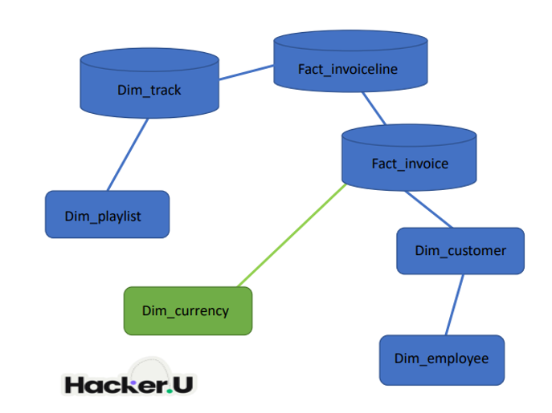

# Chinook Data Warehouse & Analytics Project

This project was built as part of my Data Analyst training.  
It demonstrates how to design a data warehouse (DWH), implement ETL processes, and perform advanced analytics with SQL and Python.

## Data Model

The Chinook database was transformed into a **star-schema** (DWH2) design:

- **Dimensions:** customer, employee, track, playlist, currency, etc.  
- **Facts:** invoices and invoice lines.  

This structure enables efficient analytical queries across multiple business questions.



## ETL Process

The project implemented a full ETL (Extract, Transform, Load) pipeline:

- **Extract:** pulled raw data from the Chinook database and external currency API.  
- **Transform:** cleaned and standardized the data, converted currency values, and applied business rules.  
- **Load:** saved the processed data into the `dwh2` schema with dimension and fact tables.  

This process ensured reliable, clean, and business-ready data for analysis.

## Analytical Results  

The project includes several advanced analyses. Below are some examples of the visual outputs:


1. **Monthly Sales Trend**  
Analyzed sales over time to identify seasonality and growth patterns.
\monthly_sales_trend_bars.png)

2. **Top 5 Customers (USD vs. ILS)**  
Compared the top 5 customers' spending in both USD and converted ILS. 
\top5_customers_spend_usd_ils.png)

3. **Seasonality by Genre** 
 Examined sales seasonality across the top 5 music genres.  
\seasonality_by_genre.png)

> Note: Each analysis was implemented twice — using direct SQL (via SQLAlchemy) and using Pandas.  
> The visualizations shown here are from the Pandas implementation. The SQL-based results are also available in the repository.

## Project Structure  

The repository is organized as follows:

- **/sql/**  
  Contains all SQL scripts for schema creation, dimension/fact tables, and analytical queries.

- **/python/**  
  Includes ETL scripts and analytical notebooks/scripts. Organized into:
  - `/etl/` – scripts for data extraction, transformation, and loading.  
  - `/analysis/` – scripts for analytical queries and visualizations (both SQL and Pandas versions).

- **/data/**  
  Raw input files (in `/raw/`) and processed outputs (in `/outputs/`).

- **/images/**  
  Visual outputs of the analyses (charts, plots, etc.), used in this README.

- **/docs/**  
  Documentation files (answer file, PDFs, etc.).

- **requirements.txt**  
  Python dependencies required to run the project.

- **.env.example**  
  Example of environment variables (without sensitive data).

## How to Run  

- **Set up a virtual environment (recommended):**  
  ```bash
  python -m venv venv
  source venv/bin/activate   # On Linux/Mac
  venv\Scripts\activate      # On Windows

Install dependencies:
pip install -r requirements.txt

Set environment variables:
Create a .env file in the project root.

Add your database connection string (see .env.example).

Run ETL process:
Use the Python scripts in /python/etl/ to load and transform data into the dwh2 schema.

- **Optional ETL (Currency Loader):**  
  An additional script (`python/etl/currency_api_loader.py`) can fetch daily USD→ILS exchange rates using a public API.  
  - Date range is inferred from `dwh2.fact_invoice` (or `stg.invoice`).  
  - Output table: `stg.usd_ils_rates`.  
  - The script supports a **dry-run** mode (default) for safe validation before loading.  


Run analyses:
SQL queries are in /sql/analysis/.
Python-based analyses are in /python/analysis/.
Generated visualizations will be saved into /images/.

View results:
Final plots and outputs are stored in /images/ and /data/outputs/.

See this README for examples.

## Requirements  

Make sure you have the following Python packages installed (these are already listed in `requirements.txt`):  

- pandas  
- SQLAlchemy  
- psycopg2-binary  
- requests  
- python-dotenv  
- matplotlib  
- numpy  
- adjustText  
